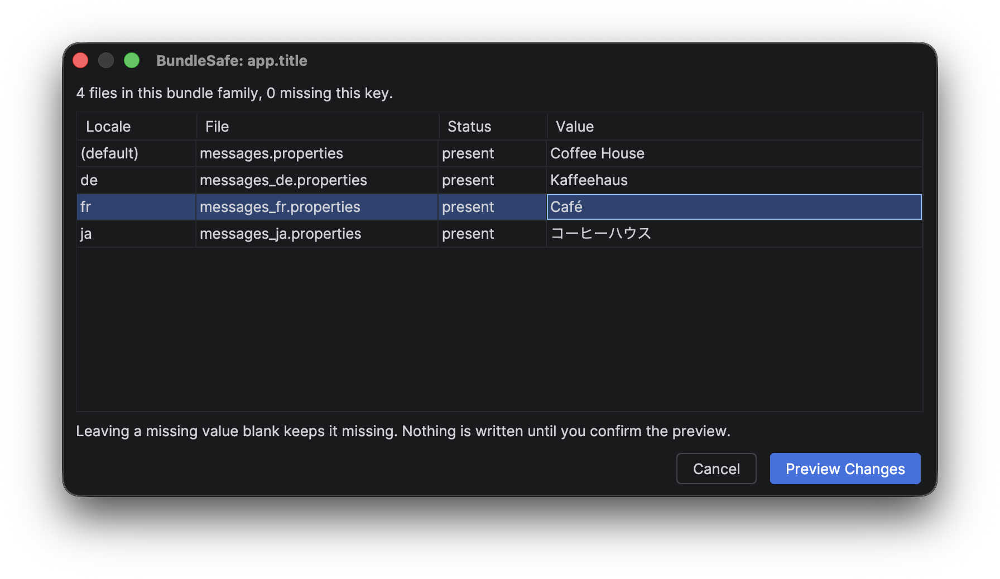
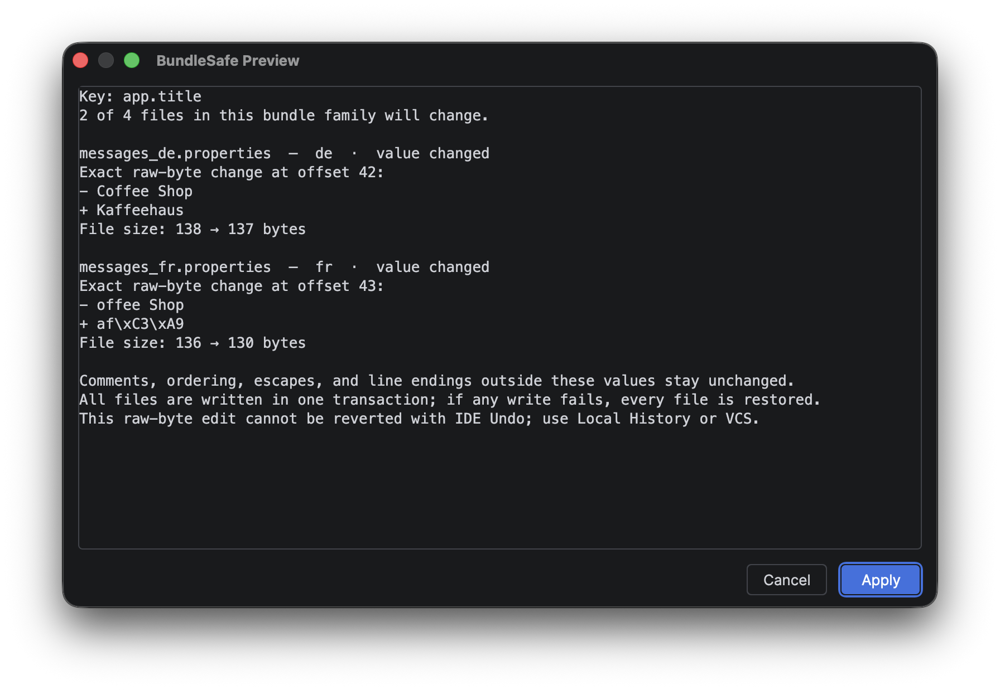

# BundleSafe

BundleSafe is a local editor for Java `.properties` resource bundles. Edit one
key across its locale files, inspect the exact per-file changes, and apply them as
one transaction.

## What it preserves

- comments, ordering, separators, and untouched escape spelling;
- UTF-8 and ISO-8859-1 files, including BOM and native-to-ASCII forms;
- CRLF, LF, mixed line endings, and missing trailing newlines;
- duplicate-key semantics used by Java.

BundleSafe works locally. It has no accounts, analytics, telemetry, or network
service.

[Report a problem](https://github.com/altairRs/BundleSafe-Support/issues) ·
[Privacy policy](PRIVACY.html) · [Security](SECURITY.html)
